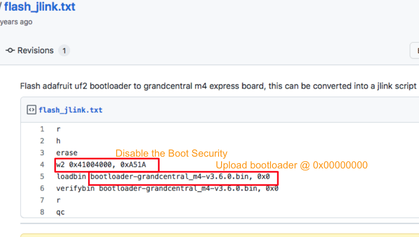
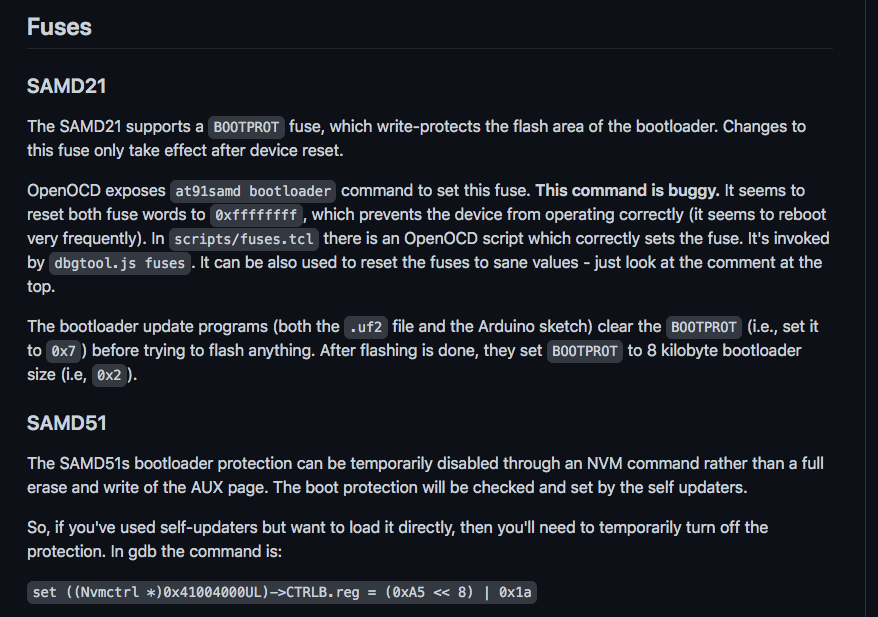

# SAMD51-Bootloader-note
my note about update SAMD51 UF2 bootloader 

- use JLinkFlash utility
- connect && erase target ATSAMD51J19
- write 2bytes for the D51 Security
- upload bootloader @ 0x0
- reboot

- SAMD21/D51 Security Fuse

# Reference: 
[Adafruit UF2 bootloader release 3.13](https://github.com/adafruit/uf2-samdx1/releases/tag/v3.13.0)  
[Flash adafruit uf2 bootloader to grandcentral m4 express board](https://gist.github.com/C47D/b54ea63f30b1e61852514ad6e1177a72)  
[UF2 SAMDX1 USB MSD
